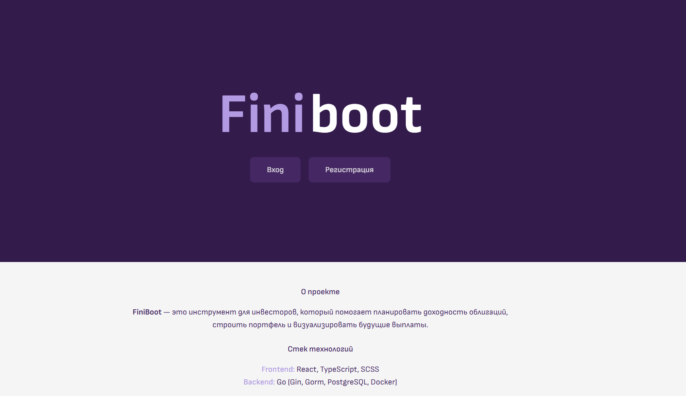
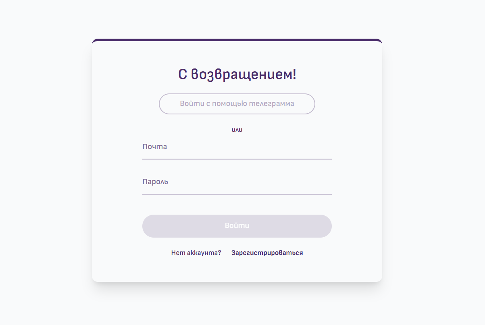
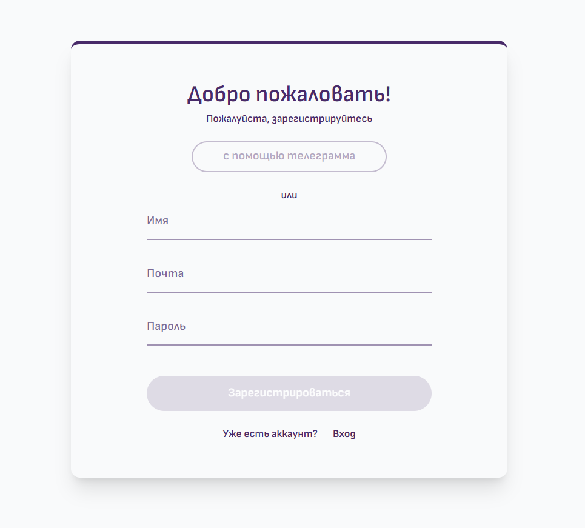
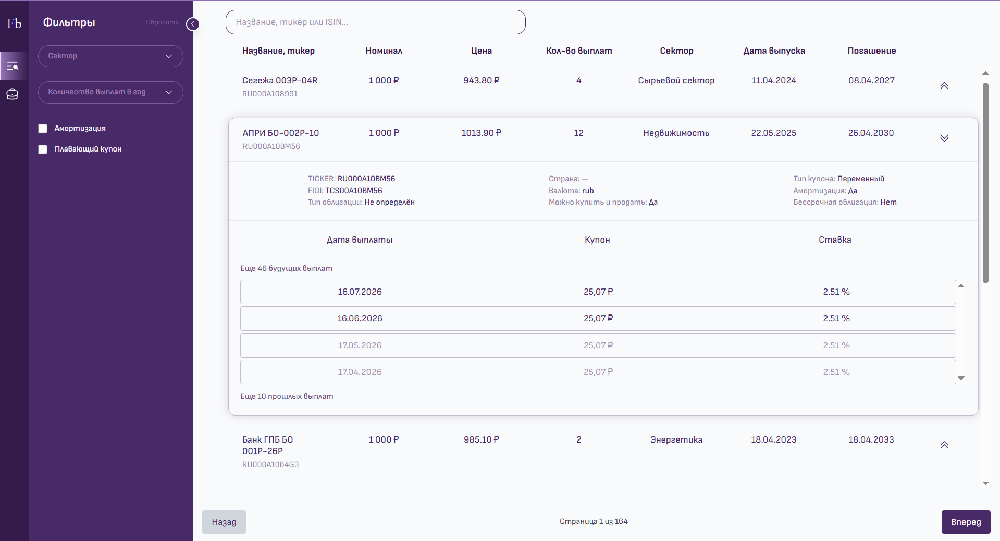
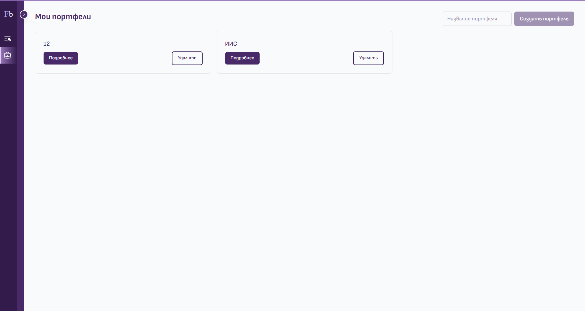
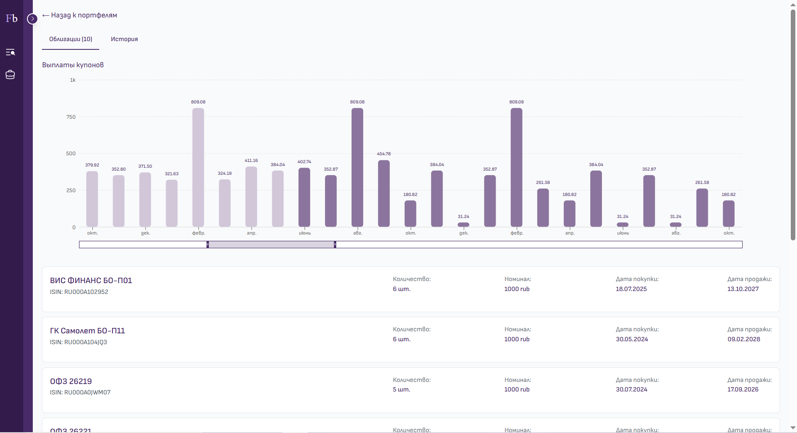

# Finiboot 

Finiboot — это сервис для подбора и визуализации инвестиционного портфеля облигаций.

Он позволяет пользователю просматривать облигации, оценивать их доходность до покупки, а также формировать и анализировать собственный портфель.


## Описание проекта

Finiboot предназначен для:
- подбора облигаций по различным фильтрам
- формирования инвестиционного портфеля
- отслеживания выплат и структуры портфеля

Проект помогает пользователю “примерить” инвестиции на практике до реального приобретения облигаций.

---

## Архитектура

Проект построен на микросервисной архитектуре и состоит из следующих компонентов:

- **auth-service** — авторизация и регистрация пользователей (JWT)
- **bonds-service** — получение и обработка данных по облигациям
- **portfolio-service** — управление пользовательскими портфелями
- **gateway** — API Gateway, маршрутизация запросов между сервисами

---

## Технологии

- Go (микросервисы)
- PostgreSQL
- Redis
- Docker
- JWT Authentication
- REST API
- External API (T-Bank Bonds API)

---

## Особенности системы

- Получение данных об облигациях через API Т-Банка
- Кэширование цен через Redis (обновление каждые 5 минут)
- Обновление данных по облигациям через background worker (каждый час)
- JWT-аутентификация пользователей
- Разделение бизнес-логики между сервисами

---

## Страницы приложения (Frontend)

> Frontend запускается отдельно (не в Docker)

### `/`
Главная страница:
- приветствие
- краткое описание сервиса
<p align="center">
  
</p>

---

### `/login` и `/register`
- регистрация пользователей
- авторизация
- получение JWT токена

<p align="center">
  
  
</p>

---

### `/bonds`
Страница облигаций:
- список всех доступных облигаций
- фильтрация:
  - по названию
  - по тикеру
  - по ISIN
  - по сектору
  - по количеству выплат
  - наличие амортизации
  - тип купона (фиксированный / плавающий)

Функции:
- просмотр детальной информации
- добавление облигаций в портфель


<p align="center">
  
</p>

---

### `/portfolio`
- список портфелей пользователя
- создание нового портфеля
- удаление портфеля

<p align="center">
  
</p>

---

### `/portfolio/:id`
Детальная страница портфеля:
- список облигаций в портфеле
- график купонных выплат
- история транзакций

<p align="center">
  
</p>


## Запуск проекта

### 1. Клонирование репозитория

```bash
git clone https://github.com/ReginaBoo/finiboot.git
cd finiboot
```

### 2. Настройка environment variables

Для работы проекта необходимо создать .env файлы в корне проекта.

Можно использовать env.example как шаблон

### 3. Запуск через Docker backend-инфраструктуры
```bash 
docker-compose up --build
```


### 3. Frontend не контейнеризирован, запускается отдельно
```bash 
cd frontend
npm install
npm run dev
```


## Примечание

Проект выполнен в учебных целях как демонстрация микросервисной архитектуры, работы с внешними API, кешированием и пользовательскими инвестиционными сценариями.


